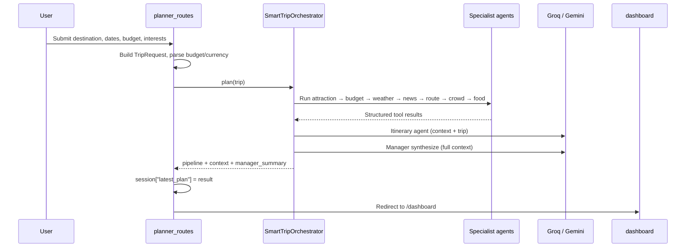

# Travelo

**Author:** Souparno

Travelo is an agentic travel planning application. Instead of asking a single chat model to invent a trip from memory, Travelo runs a **manager-led multi-agent pipeline** that gathers live and local data (attractions, weather, routes, news, crowds, budget, food) and then uses an LLM only where synthesis and natural language help—while keeping structured planning reliable even when APIs or keys are missing.

---

## What is Travelo?

Travelo is a Flask web app that turns a trip request (destination, dates, budget, interests, origin) into a **structured travel dashboard**: day-by-day itinerary, budget status, weather outlook, routing hints, crowd guidance, food recommendations, news context, and a manager-written summary.

Under the hood it is built as **SmartTripAI**:

- **Specialist agents** each own one domain (attractions, budget, weather, and so on).
- **Tools** wrap external APIs and local datasets with stable interfaces.
- **Services** hold HTTP clients, parsing, and deterministic fallbacks.
- A **Manager Agent** (Groq or Gemini) reads all specialist outputs and produces a concise, honest trip brief.
- An **Itinerary Agent** builds the day-by-day plan using the same LLM configuration as the manager.

You can use Travelo through the browser (`/planner`, `/dashboard`) or the JSON API (`POST /api/plan`, chat endpoints).

---

## Why Travelo?

| Problem with “just ask ChatGPT” | How Travelo addresses it |
| --- | --- |
| Models hallucinate venues, prices, and weather | Specialists call **real providers** (Overpass, WeatherAPI, OpenRouteService, NewsData.io) or **curated local JSON** |
| One prompt cannot reliably orchestrate many APIs | A fixed **orchestrator pipeline** runs agents in a sensible order and passes context forward |
| Generic answers ignore your budget and dates | `TripRequest` drives **budget checks**, **day count**, and **interest-based** attraction search |
| App breaks when an API key is missing | Services **fall back** to deterministic local planning; the demo keeps running |
| Travel questions mixed with side questions get lost | The manager prompt asks for both a **plan summary** and a **Side answer** when needed |

Travelo is a **demo-grade but production-minded** architecture: clear separation between routes, agents, tools, and services, with tests under `tests/`.

---

## Why Travelo can be better than other LLMs (alone)

A general-purpose LLM (ChatGPT, Claude, Gemini in a single chat box) is strong at language but weak as a **travel operating system** unless you bolt on tools yourself. Travelo is designed around that gap:

1. **Grounded data, not guesses**  
   Attractions come from OpenStreetMap / Overpass; weather from WeatherAPI; routes from OpenRouteService; news from NewsData.io. The LLM **summarizes and narrates** what tools already fetched—it does not invent coordinates or closure dates.

2. **Purpose-built agents**  
   Each agent has a narrow job and prompt (see `prompts/`). That beats one giant system prompt that must simultaneously be a geographer, meteorologist, economist, and chef.

3. **Deterministic backbone**  
   Budget scoring, crowd rules (`data/crowd_rules.json`), city costs (`data/city_costs.json`), and itinerary day scaffolding run **without** an LLM. If Groq/Gemini is down or unconfigured, you still get a usable plan.

4. **Controlled LLM use**  
   Only the **Manager** and **Itinerary** agents call the LLM (`services/gemini_service.py`). Payload size is capped (`MAX_LLM_MESSAGE_CHARS`). HTTP 413 responses trigger local summaries instead of failing the whole trip.

5. **Transparent pipeline**  
   API responses include a `pipeline` array: every agent’s output is visible for debugging and UI, not hidden inside one opaque model reply.

6. **Travel-specific UX**  
   Currency parsing, history, natural-language trip extraction in `api_routes.py`, and dashboard templates are built for **planning workflows**, not open-ended chat only.

Travelo still uses LLMs where they shine (summary, prose, side questions). It does not claim to replace frontier models—it **combines** them with tools and structure so travel answers are more **accurate, inspectable, and repeatable**.

---

## Step-by-step: how a trip is planned

### A. Web form flow (`POST /planner`)



1. **User opens** `http://127.0.0.1:5000/planner` and fills the form.
2. **`planner_routes.create_plan`** parses the form, normalizes budget via `currency_service`, and builds a `TripRequest`.
3. **`SmartTripOrchestrator.plan`** runs specialists **in order**:
   - **Attraction Agent** — Overpass/Nominatim search by destination and interests.
   - **Budget Agent** — Compares expected costs to budget using local cost data and rules.
   - **Weather Agent** — Fetches current/forecast-style data from WeatherAPI (or fallback).
   - **News Agent** — Destination-related headlines from NewsData.io (or fallback).
   - **Route Agent** — Walking/transit hints from OpenRouteService when keyed.
   - **Crowd Agent** — Combines weather, news, route, dates, and `crowd_rules.json`.
   - **Food Agent** — Local and LLM-assisted food/drink suggestions for the destination.
4. **Context dict** is assembled (attractions, budget, weather, news, route, crowds, food, optional `user_question`).
5. **Itinerary Agent** builds per-day activities from attractions + weather + crowds, then asks the LLM for a short summary (or uses local text if no key).
6. **Manager Agent** sends a trimmed context to the LLM and returns `manager_summary` (or `_local_summary` fallback).
7. **Result** is stored in the Flask session and the user lands on the **dashboard** with charts, itinerary, and agent cards.

### B. API / chat flow (`POST /api/plan` and related)

- JSON body can include explicit fields or a natural-language `message` (destination and budget extracted with regex helpers).
- Same orchestrator runs; response includes `trip`, `pipeline`, `context`, and `manager_summary`.
- **General chat** (`GeneralChatAgent`) answers lightweight questions via Groq without running the full pipeline when appropriate.

### C. Server lifecycle

- On each `python app.py` start, `create_app()` calls `clear_history()` so demo chat history resets (see `services/history_service.py`).

---

## Project layout (working directory)

Repository root: **`tragent/`** (project name on disk). The product name in the UI and docs is **Travelo**.

```
tragent/
├── app.py                 # Flask entry: blueprints, secret key, history reset on boot
├── config.py              # Loads .env; all API URLs, keys, limits (MAX_TRIP_DAYS, etc.)
├── pyproject.toml         # Hatch project metadata and default virtual env (.venv)
├── requirements.txt       # Pip-compatible dependency list (mirrors pyproject.toml)
├── .env                   # Secrets and provider toggles (never commit)
│
├── agents/                # One folder per specialist + manager orchestration
│   ├── manager/
│   │   ├── orchestrator.py    # SmartTripOrchestrator — runs the full pipeline
│   │   └── manager_agent.py   # LLM synthesis of final trip brief
│   ├── attraction/        # OSM / Overpass attractions
│   ├── budget/            # Budget fit vs city_costs.json
│   ├── weather/           # WeatherAPI integration
│   ├── news/              # NewsData.io headlines
│   ├── route/             # OpenRouteService directions
│   ├── crowd/             # Crowd levels from rules + other agents
│   ├── food/              # Food and drink recommendations
│   ├── itinerary/         # Day-by-day plan + LLM summary
│   └── general_chat_agent.py  # Standalone Groq chat without full pipeline
│
├── tools/                 # Thin wrappers agents call (stable function boundaries)
│   ├── attraction_tools.py
│   ├── budget_tools.py
│   ├── weather_tools.py
│   ├── news_tools.py
│   ├── route_tools.py
│   └── food_tools.py
│
├── services/              # HTTP clients, business logic, fallbacks, SQLite history
│   ├── gemini_service.py  # LLMService — Groq or Gemini for manager/itinerary
│   ├── attraction_service.py, weather_service.py, route_service.py, ...
│   ├── currency_service.py, budget_service.py, food_service.py
│   ├── history_service.py # chat_history table read/write
│   └── data_loader.py     # Loads JSON from data/
│
├── models/                # Dataclasses (TripRequest, budget, itinerary shapes)
├── routes/                # Flask blueprints
│   ├── home_routes.py     # GET /
│   ├── planner_routes.py  # GET/POST /planner
│   ├── dashboard_routes.py
│   └── api_routes.py      # /api/plan, chat, history, health
│
├── prompts/               # Text prompts for agents (manager, itinerary, weather, …)
├── data/                  # Offline datasets (no API key required)
│   ├── city_costs.json
│   ├── city_metadata.json
│   ├── crowd_rules.json
│   └── holidays.json
│
├── database/
│   ├── schema.sql         # trips, plans, chat_history tables
│   └── seed_data.sql      # Optional seed content
│
├── templates/             # Jinja2 HTML (home, planner, dashboard, itinerary, error)
├── static/                # CSS and JS (planner.js, dashboard.js)
├── tests/                 # pytest: agents, routes, services, tools
└── docs/                  # architecture.md, setup_guide.md, api_documentation.md
```

**Dependency direction (keep this in mind when editing):**

`routes` → `agents` / `orchestrator` → `tools` → `services` → external APIs or `data/`  
`agents` → `models` and `config`  
UI reads session/API results; it does not call providers directly.

---

## Hatch: virtual environment and project tooling

This project uses **[Hatch](https://hatch.pypa.io/)** instead of manually creating `python -m venv` and juggling `pip install` for every machine. Hatch is a modern Python project manager from the PyPA ecosystem; here it acts as your **venv + dependency locker + run scripts**.

### What Hatch does here

| Hatch feature | Role in Travelo |
| --- | --- |
| **Virtual env** | Creates and manages `.venv/` in the project root (`[tool.hatch.envs.default]` → `path = ".venv"`) |
| **Dependencies** | Installs packages from `pyproject.toml` so everyone gets the same Flask, requests, pytest versions |
| **Isolation** | Project deps stay inside `.venv`, not your global Python |
| **Scripts** | Shortcuts: `hatch run app` starts Flask; `hatch run test` runs pytest |
| **No manual activate** | `hatch run <command>` runs inside the env without remembering `Activate.ps1` |

Hatch does **not** replace your `.env` API keys; it only manages Python packages and the interpreter environment.

### Install Hatch (once per machine)

```powershell
pip install hatch
```

### First-time project setup

From the repository root (`D:\tragent` or your clone path):

```powershell
# Create .venv and install dependencies from pyproject.toml
hatch env create

# Optional: open a shell already inside the virtual env
hatch shell
```

### Everyday commands

```powershell
# Run the web app (equivalent to: .venv\Scripts\python app.py)
hatch run app

# Run tests
hatch run test

# Run any command inside the env without activating
hatch run python -m pytest tests/test_routes.py -v

# Recreate the env after dependency changes
hatch env prune
hatch env create
```

### Hatch vs classic venv + pip

| Step | Classic venv | Hatch (this repo) |
| --- | --- | --- |
| Create env | `python -m venv .venv` | `hatch env create` |
| Activate | `.\.venv\Scripts\Activate.ps1` | optional; prefer `hatch run` |
| Install deps | `pip install -r requirements.txt` | automatic on env create |
| Run app | `python app.py` | `hatch run app` |

You can still use `pip install -r requirements.txt` inside `.venv` if you prefer; `requirements.txt` is kept in sync for compatibility.

### Where Hatch stores things

- **Project env:** `.venv/` (gitignored) — local to this folder.
- **Hatch metadata:** may use a user-level cache; the important part is `.venv` beside `app.py`.

---

## Quick start

**Prerequisites:** Python 3.11+, [Hatch](https://hatch.pypa.io/latest/install/), API keys in `.env` (see below).

```powershell
cd D:\tragent
hatch env create
# Create .env in the project root (see Environment variables below)
hatch run app
```

Open **http://127.0.0.1:5000** → **Planner** → submit a trip → view **Dashboard**.

Missing or placeholder keys do **not** crash the app; services use deterministic local output where possible.

---

## Environment variables (`.env`)

| Variable | Purpose |
| --- | --- |
| `LLM_PROVIDER` | `groq` (default) or `gemini` — manager + itinerary |
| `GROQ_API_KEY`, `GROQ_MODEL` | Groq chat completions |
| `GEMINI_API_KEY`, `GEMINI_MODEL` | Google Gemini alternative |
| `WEATHER_API_KEY`, `WEATHER_API_URL` | WeatherAPI current weather |
| `OPENROUTESERVICE_API_KEY` | Walking route directions |
| `NEWSDATA_API_KEY`, `NEWSDATA_API_URL` | Destination news |
| `OVERPASS_API_URL`, `NOMINATIM_API_URL` | OpenStreetMap (no key) |
| `FLASK_SECRET_KEY` | Session signing |
| `DATABASE_PATH` | SQLite path (default: `database/smarttrip.db`) |

Optional: `WEATHER_GEOCODING_API_URL`, `WEATHER_GEOCODING_API_KEY` (reserved for a future geocoder).

Example:

```env
LLM_PROVIDER=groq
GROQ_API_KEY=your_groq_key_here

WEATHER_API_KEY=your_weatherapi_key_here
OPENROUTESERVICE_API_KEY=your_ors_key_here
NEWSDATA_API_KEY=your_newsdata_key_here
```

---

## Agent and provider map

| Agent | Provider | API key? | `.env` variables |
| --- | --- | --- | --- |
| Manager Agent | Groq or Gemini | Yes | `LLM_PROVIDER`, `GROQ_API_KEY`, `GEMINI_API_KEY` |
| Itinerary Agent | Same as manager | Yes | Same as manager |
| Attraction Agent | OpenStreetMap / Overpass | No | `OVERPASS_API_URL`, `NOMINATIM_API_URL` |
| Budget Agent | Local JSON / database | No | — |
| Weather Agent | WeatherAPI | Yes | `WEATHER_API_KEY`, `WEATHER_API_URL` |
| Route Agent | OpenRouteService | Yes | `OPENROUTESERVICE_API_KEY` |
| News Agent | NewsData.io | Yes | `NEWSDATA_API_KEY`, `NEWSDATA_API_URL` |
| Crowd Agent | Derived + `crowd_rules.json` | No | — |
| Food Agent | Local + context | No | — |
| General Chat | Groq (via `GeneralChatAgent`) | Yes | `GROQ_API_KEY` |

---

## API reference (short)

**`POST /api/plan`**

```json
{
  "destination": "Paris",
  "origin": "CDG Airport",
  "start_date": "2026-06-10",
  "end_date": "2026-06-12",
  "travelers": 2,
  "budget": 1500,
  "interests": "art, food"
}
```

Response: `trip`, `pipeline`, `context`, `manager_summary`.

Full details: [docs/api_documentation.md](docs/api_documentation.md).

---

## Testing

```powershell
hatch run test
# or
hatch run python -m pytest tests/ -v
```

---

## Further reading

- [docs/architecture.md](docs/architecture.md) — component overview  
- [docs/setup_guide.md](docs/setup_guide.md) — legacy venv + pip setup  
- [docs/api_documentation.md](docs/api_documentation.md) — HTTP API  

---

## Author

**Souparno** — Travelo / SmartTripAI agentic travel planner.
